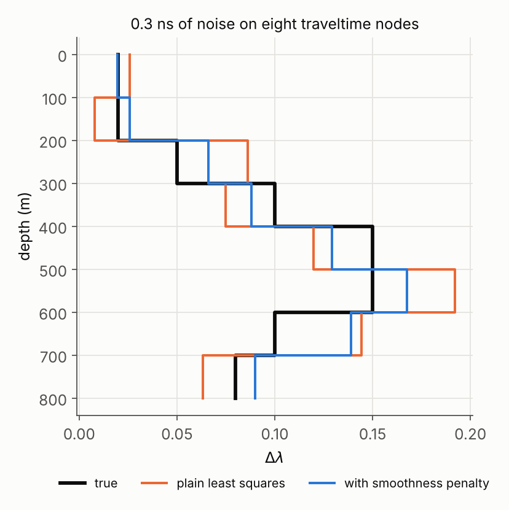

# What the inversion can resolve

This is page 3 of 3. It uses the ideas from
[page 1](fabric-linear-algebra.md) (matrices acting on vectors, the dot
product, eigenvalues of symmetric matrices) and the traveltime result from
[page 2](fabric-eigenvalues.md), §6. Sections of earlier pages are cited as "page 1, §n".

Pages 1 and 2 were about the fabric itself. This page is about the
**inversion**: turning measured traveltime differences into a depth profile of
$\Delta\lambda$. The inversion builds a second symmetric matrix, and
its eigenvalues answer a practical question: *which features of a fabric
profile can the data actually see?*

## 1. The forward problem as a matrix

Split the ice column into intervals, numbered from the surface down, and let
$\Delta\lambda_i$ be the fabric strength in interval $i$. From page 2, §6,
crossing interval $i$ adds a traveltime difference of
$g\,\Delta z_i\,\Delta\lambda_i$, with $g \approx 0.064$ ns per metre.

A reflector at the bottom of interval $k$ (a **node**) has collected the delay of
*every* interval above it. With three intervals of 100 m each, so
$g\,\Delta z = 6.39$ ns:

$$
\begin{aligned}
\Delta\tau_1 &= 6.39\,\Delta\lambda_1\\
\Delta\tau_2 &= 6.39\,\Delta\lambda_1 + 6.39\,\Delta\lambda_2\\
\Delta\tau_3 &= 6.39\,\Delta\lambda_1 + 6.39\,\Delta\lambda_2 + 6.39\,\Delta\lambda_3
\end{aligned}
$$

That is exactly a matrix acting on a vector (page 1, §3):

$$
\underbrace{\begin{bmatrix}\Delta\tau_1\\ \Delta\tau_2\\ \Delta\tau_3\end{bmatrix}}_{\mathbf{d}}
= \underbrace{6.39\begin{bmatrix}1&0&0\\1&1&0\\1&1&1\end{bmatrix}}_{G}
\underbrace{\begin{bmatrix}\Delta\lambda_1\\ \Delta\lambda_2\\ \Delta\lambda_3\end{bmatrix}}_{\mathbf{x}}
\qquad\text{or simply}\qquad
\mathbf{d} = G\,\mathbf{x}
$$

The matrices here are $3\times3$ or larger rather than $2\times2$, but every
rule from page 1 works the same way with more rows and columns. $G$ is the
**forward model**: give it a fabric profile and it predicts the data. The real model in
`ptt.twttDifference` adds firn and ray bending, and the code computes its
version of $G$ numerically (the Jacobian `A` in
`invertHorizontalFabricJoint`). It is very close to this simple
"running total" matrix.

## 2. Running it backwards, and why noise hurts

Without noise, running $G$ backwards is easy: subtract consecutive nodes.

$$
\Delta\lambda_2 = \frac{\Delta\tau_2 - \Delta\tau_1}{6.39}
$$

This is **layer stripping**, the exact solve in `invertHorizontalFabric`.
The trouble is that real nodes carry noise, say 0.3 ns each. Subtracting two
noisy numbers gives a result whose noise is about $\sqrt2 \times 0.3$ ns, and
dividing by 6.39 turns that into an error of about $\pm 0.066$ in
$\Delta\lambda$. Fabric contrasts are often around 0.1, so that error is not small.
Thinner intervals make it worse, because the denominator shrinks.

The inversion needs a way to say "fit the data well, but don't chase the
noise". That is least squares.

## 3. Least squares

Instead of matching every node exactly, choose the profile $\mathbf{x}$ that
makes the total squared misfit as small as possible:

$$
\text{misfit}(\mathbf{x}) = \sum_k \big(\text{predicted}_k - \text{observed}_k\big)^2
= \sum_k \big((G\mathbf{x})_k - d_k\big)^2
$$

Squaring makes every misfit count as positive and punishes large misses most.
It is the same idea as fitting a straight line through scattered points.

**Where the minimum is.** Each column of $G$ is the data pattern that one
interval produces. At the best fit, the leftover misfit
$\mathbf{d} - G\mathbf{x}$ contains nothing that any interval could still
explain. In page 1 terms, it is *perpendicular* to every column of $G$, so
its dot product (page 1, §2) with each column is zero. Collecting those dot
products into one equation gives the **normal equations**:

$$
\boxed{G^T G\,\mathbf{x} = G^T\mathbf{d}}
$$

The code solves a weighted version with a regularization term added (§6), but the
structure is the same. The matrix on the left,

$$
N = G^T G
$$

is called the **normal matrix**, and it is **symmetric**: $N_{ij}$ is the
dot product of columns $i$ and $j$ of $G$, which is the same in either order. So
everything from page 1, §8 applies: real eigenvalues and perpendicular
eigenvectors.

## 4. Eigenvectors of the normal matrix are depth patterns

An eigenvector of $N$ is a list of numbers, one for each interval, so it describes a
**depth pattern** of $\Delta\lambda$. Its eigenvalue has a direct
meaning. For a unit eigenvector $\mathbf{v}$,

$$
\lambda = \mathbf{v}^T N \mathbf{v} = |G\mathbf{v}|^2
$$

which is *how much traveltime signal that pattern of fabric produces*. A
pattern with a large eigenvalue leaves a big footprint in the data and is
pinned down well. A pattern with a small eigenvalue barely changes the data.
The data cannot tell whether it is there, so noise can push the solution along it
almost freely. The size of the error along each pattern scales like
$1/\sqrt{\lambda}$.

Here are eight 100 m intervals:

=== "Python"

    ```python
    import numpy as np

    c, eps_p, deps = 0.299792458, 3.15, 0.034
    g = deps / (c * np.sqrt(eps_p))          # 0.0639 ns per m per unit dlam

    m, dz = 8, 100.0                         # 8 intervals of 100 m
    G = g * dz * np.tril(np.ones((m, m)))    # the "running total" matrix
    N = G.T @ G

    w, V = np.linalg.eigh(N)                 # smallest eigenvalue first
    print(w)
    print(V[:, -1])                          # best-resolved pattern
    print(V[:, 0])                           # worst-resolved pattern
    ```

=== "MATLAB"

    ```matlab
    c = 0.299792458; eps_p = 3.15; deps = 0.034;
    g = deps / (c * sqrt(eps_p));

    m = 8; dz = 100;
    G = g * dz * tril(ones(m));
    N = G' * G;

    [V, L] = eig(N);
    disp(diag(L)')
    disp(V(:, end)')                         % best-resolved
    disp(V(:, 1)')                           % worst-resolved
    ```

```
eigenvalues  10.6  11.7  14.1  18.7  28.1  51.4  136  1199
```


- The **best-resolved** pattern (eigenvalue 1199) is smooth, has one sign, and is
  weighted toward the surface. Shallow intervals are seen by every node below them, so
  the data pin this pattern down well. Roughly, it is the column-average contrast.
- The **worst-resolved** pattern (eigenvalue 11, about 110 times
  smaller) **alternates sign from one interval to the next**. Its delays nearly
  cancel in the running totals, so it barely changes the data. Noise therefore pushes
  the solution toward exactly this zig-zag. The header of
  `invertHorizontalFabricJoint` calls it "noise-amplified oscillation".

The ratio of the largest to the smallest eigenvalue, here
$1199 / 10.6 \approx 113$, is the **condition number**. It is a single number
for how unevenly the data constrain different patterns.

## 5. Seeing it happen

Take a true profile, run it forward through $G$, add 0.3 ns of noise to
each node, and solve the normal equations:



The plain least-squares answer (orange) zig-zags around the truth (black).
That zig-zag is the worst-resolved eigenvector, picked up from the noise.

## 6. The smoothness penalty lifts the small eigenvalues

`invertHorizontalFabricJoint` adds a penalty on jumps between neighbouring
intervals. The jumps are $\Delta\lambda_2 - \Delta\lambda_1$,
$\Delta\lambda_3 - \Delta\lambda_2$, and so on, which is again a matrix acting on
the profile:

$$
D\mathbf{x} = \begin{bmatrix}-1&1&0\\0&-1&1\end{bmatrix}
\begin{bmatrix}\Delta\lambda_1\\ \Delta\lambda_2\\ \Delta\lambda_3\end{bmatrix}
= \begin{bmatrix}\Delta\lambda_2-\Delta\lambda_1\\ \Delta\lambda_3-\Delta\lambda_2\end{bmatrix}
$$

Adding $\alpha$ times the squared jumps to the misfit changes the normal
matrix to

$$
N_\alpha = G^T G + \alpha\, D^T D
$$

This is the matrix the code inverts at each Gauss–Newton step,
`(A'*W*A + alpha*(D'*D))`, with $\alpha$ set by `opts.reg`. $D^T D$ is large
for zig-zag patterns, because every interval jumps, and small for smooth
ones. Adding it therefore raises exactly the eigenvalues that were too small:

=== "Python"

    ```python
    D = np.diff(np.eye(m), axis=0)           # the jump matrix
    alpha = 0.05 * np.trace(N) / m           # the code's default reg = 0.05
    print(np.linalg.eigvalsh(N + alpha * D.T @ D))
    ```

=== "MATLAB"

    ```matlab
    D = diff(eye(m));
    alpha = 0.05 * trace(N) / m;
    disp(eig(N + alpha * (D' * D))')
    ```

```
before   10.6  11.7  14.1  18.7  28.1  51.4  136  1199
after    33.0  39.7  41.1  43.4  46.0  57.7  139  1199
```

The smallest eigenvalue triples (10.6 to 33.0), while the largest barely moves.
The condition number drops from 113 to 36, and the blue profile in the figure
above stops zig-zagging. The price is that a genuinely sharp change in fabric
gets smoothed a little. That is the trade the code makes: some depth
resolution in exchange for stability.

## 7. A zero eigenvalue: the reference offset

The radar's traveltime differences are measured relative to a reference
just below the surface. Any error in that reference shifts *every* node by the
same constant. With `obs.zref` set, the joint solve estimates that constant
as one more unknown, which adds a column of ones to $G$:

=== "Python"

    ```python
    Ga = np.hstack([G, np.ones((m, 1))])     # one more unknown: the offset
    w, V = np.linalg.eigh(Ga.T @ Ga)
    print(w[0])                              # 0, to rounding
    print(V[:, 0] / abs(V[:, 0]).max())      # [0.156 0 0 0 0 0 0 0 -1]
    ```

=== "MATLAB"

    ```matlab
    Ga = [G, ones(m, 1)];
    [V, L] = eig(Ga' * Ga);
    disp(L(1, 1))
    disp(V(:, 1)' / max(abs(V(:, 1))))
    ```

The smallest eigenvalue is now **exactly zero**. By §4, that means a pattern that produces
*no signal at all*. Its eigenvector involves only two unknowns: the
shallowest interval's $\Delta\lambda_1$ and the offset, in the ratio
$1/6.39 = 0.156$.

The reason is visible in $G$ itself. Every node sees all of interval 1, so
the first column of $G$ is a constant, 6.39 in every row. A column of ones is
the same shape. "A bit more fabric in interval 1" and "a slightly shifted
reference" change the data in exactly the same way, and no amount of data can
separate them.

Along a zero-eigenvalue direction the data give no information. Only the penalty
and the prior on the offset (`ref_sigma_ns`) decide how the answer is split. This
is why the code sets `out.ref_degenerate(1) = true`, why the fabric
products carry a `dlam_ref_degenerate` flag, and why fabric is quoted from
interval 2 down.

## Exercises

??? question "1. Thinner intervals"
    Rerun §4 with `m = 20, dz = 40`. What happens to the condition number,
    and why?

    **Answer.** It grows from about 113 to about 680, roughly as $m^2$.
    Thinner intervals allow more zig-zag patterns, and each produces even
    less signal. Finer depth resolution costs stability, which is the reason to
    choose `num_intervals` with the noise level in mind.

??? question "2. Stronger penalty"
    Set `alpha` ten times larger. What happens to the eigenvalues, and what
    would you expect to see in the recovered profile?

    **Answer.** The small eigenvalues rise further and the condition number
    falls, so the solution gets steadier. But real changes in fabric between neighbouring
    intervals now get smoothed out as well. Past a point you are fitting
    the penalty rather than the data.

??? question "3. Reading a pattern"
    The best-resolved eigenvector is largest near the surface and smallest
    near the bed. Why?

    **Answer.** Interval 1 contributes to all eight nodes and interval 8 to only
    one. A change near the surface therefore moves eight data points, while a change near
    the bed moves one.

??? question "4. Why the zero eigenvalue is exact"
    Write $G_a = [G\ \ \mathbf{1}]$ for $G$ with the column of ones added.
    Show by hand that $G_a\mathbf{v} = \mathbf{0}$ for
    $\mathbf{v} = (1, 0, \dots, 0, -6.39)$, the eigenvector from §7 scaled
    differently.

    **Answer.** Row $k$ of $G_a$ times $\mathbf{v}$ is
    $6.39 \times 1 + 1 \times (-6.39) = 0$ for every $k$: only the first and
    last entries of $\mathbf{v}$ are non-zero. Since $G_a\mathbf{v} = \mathbf{0}$,
    $|G_a\mathbf{v}|^2 = 0$, and by §4 the eigenvalue is zero.

## Back to the data

[Fabric from quad-pol accumulation radar](fabric-polarimetry.md) runs the
real chain: it measures $\Delta\tau$ and inverts it with the regularized joint
solve described here.
