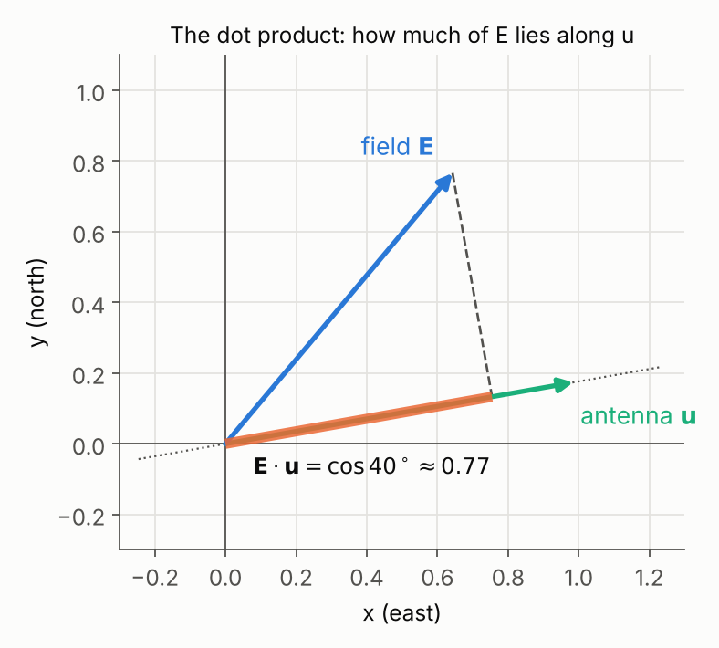

# Vectors, matrices and eigenvalues from scratch

This is the first of three pages that build up the mathematics behind the
[fabric inversion](fabric-polarimetry.md). It assumes **no linear algebra at
all**: if you can multiply, add, and use a calculator for $\cos$ and
$\sqrt{\ }$, you have everything you need.

| page | what it does |
|---|---|
| **1. this page** | vectors, matrices, and what an eigenvalue is |
| 2. [The horizontal fabric matrix](fabric-eigenvalues.md) | uses page 1 to describe ice fabric, and shows what the radar measures |
| 3. [What the inversion can resolve](fabric-inversion-eigenvalues.md) | uses page 1 again on the equations the code solves |

Every idea comes with a small example worked by hand, then the same example in
Python and MATLAB so you can check it. Each section ends with a short
**why this matters for fabric** note, so you can see where it is going.

## 1. Vectors: arrows written as numbers

On a map, "2 km east and 1 km north" describes an arrow. We write it as a
pair of numbers in brackets,

$$\mathbf{v} = (2,\ 1)$$

and call it a **vector**. The first number is the **x-component** (east) and
the second is the **y-component** (north). Bold letters such as
$\mathbf{v}$ mean "this is a vector, not a single number".


**Length.** The arrow is the long side of a right triangle, so by
Pythagoras its length is

$$|\mathbf{v}| = \sqrt{2^2 + 1^2} = \sqrt5 \approx 2.24$$

**Unit vectors.** A vector of length 1 only carries a *direction*. A unit
vector pointing at an angle $\psi$ from east is

$$\mathbf{u} = (\cos\psi,\ \sin\psi)$$

You can check the length: $\cos^2\psi + \sin^2\psi = 1$. We will use unit vectors
for two things: the direction a radar **antenna** points, and the direction
of an ice crystal's **c-axis**.

!!! info "Why this matters for fabric"
    Every ice crystal has a symmetry axis called its **c-axis**, and we describe it
    with a unit vector $\mathbf{c}$. The right panel above shows a
    complication that will matter later: $\mathbf{c}$ and $-\mathbf{c}$
    are the *same* crystal. An axis is a line through the crystal, not an arrow with
    a head.

## 2. The dot product: how much of one arrow lies along another

Multiply the two vectors component by component and add:

$$\mathbf{a}\cdot\mathbf{b} = a_x b_x + a_y b_y$$

This single number is the **dot product**. When both are unit vectors, it is the
cosine of the angle between them:

$$\mathbf{a}\cdot\mathbf{b} = \cos(\text{angle between } \mathbf{a} \text{ and } \mathbf{b})$$

It is 1 when they are parallel, 0 when they are perpendicular, and $-1$
when they point opposite ways.



**Worked example.** A radar wave's electric field $\mathbf{E}$ points at
50°, and an antenna $\mathbf{u}$ points at 10°:

$$
\mathbf{E} = (\cos 50°,\ \sin 50°) = (0.643,\ 0.766), \qquad
\mathbf{u} = (\cos 10°,\ \sin 10°) = (0.985,\ 0.174)
$$

$$
\mathbf{E}\cdot\mathbf{u} = 0.643 \times 0.985 + 0.766 \times 0.174 = 0.766 = \cos 40°
$$

The antenna picks up 0.766 of the field, which is the orange stretch in the figure.
Geometrically, this is the **projection** of $\mathbf{E}$ onto $\mathbf{u}$.

!!! info "Why this matters for fabric"
    An antenna records only the part of the field that lies along it, so
    every polarimetric measurement is a dot product. Rotating the antennas
    changes which part they record.

## 3. Matrices: machines that turn vectors into vectors

A **matrix** is a grid of numbers. A $2\times2$ matrix has two rows and
two columns:

$$
A = \begin{bmatrix} 2 & 1 \\ 1 & 2 \end{bmatrix}
$$

We name the entries by row, then column: $A_{12}$ is row 1, column 2, which
is 1 here.

A matrix is useful because it **acts on a vector** and produces a new vector.
The rule is this: each entry of the output is the dot product of one *row* of
the matrix with the input vector.

$$
A\mathbf{v} =
\begin{bmatrix} 2 & 1 \\ 1 & 2 \end{bmatrix}
\begin{bmatrix} 1 \\ 0 \end{bmatrix}
=
\begin{bmatrix} 2\times1 + 1\times0 \\ 1\times1 + 2\times0 \end{bmatrix}
=
\begin{bmatrix} 2 \\ 1 \end{bmatrix}
$$

(Vectors are written as columns when a matrix acts on them. It is the same
pair of numbers.) Try a few more with the same $A$:

| input $\mathbf{v}$ | output $A\mathbf{v}$ | what happened |
|---|---|---|
| $(1,\ 0)$ | $(2,\ 1)$ | stretched **and turned** |
| $(0,\ 1)$ | $(1,\ 2)$ | stretched and turned |
| $(1,\ 1)$ | $(3,\ 3)$ | same direction, 3 times longer |
| $(1,\ -1)$ | $(1,\ -1)$ | unchanged |

Look at the last two rows. Most inputs come out pointing a new way, but
$(1, 1)$ and $(1, -1)$ come out pointing exactly the way they went in. Keep
that in mind; it is the whole idea of section 6.

=== "Python"

    ```python
    import numpy as np

    A = np.array([[2, 1],
                  [1, 2]])
    for v in [(1, 0), (0, 1), (1, 1), (1, -1)]:
        print(v, A @ np.array(v))     # @ is matrix multiplication
    ```

=== "MATLAB"

    ```matlab
    A = [2 1; 1 2];
    V = [1 0; 0 1; 1 1; 1 -1]';       % one input per column
    disp(A * V)                       % * is matrix multiplication
    ```

## 4. Four kinds of matrix you will meet

**The identity**, $I$, does nothing: $I\mathbf{v} = \mathbf{v}$.

$$I = \begin{bmatrix} 1 & 0 \\ 0 & 1 \end{bmatrix}$$

**A diagonal matrix** has zeros off the diagonal. It stretches each axis
separately. For example, $\begin{bmatrix} 3 & 0 \\ 0 & 1\end{bmatrix}$ triples
the x-component and leaves the y-component alone. Because nothing mixes x and y, it
is the easiest kind of matrix to understand.

**A rotation matrix** turns every vector by the angle $\psi$ without
changing its length:

$$
R(\psi) = \begin{bmatrix} \cos\psi & -\sin\psi \\ \sin\psi & \cos\psi \end{bmatrix}
$$

Check with $\psi = 30°$: $R\,(1, 0) = (\cos 30°, \sin 30°) = (0.866, 0.5)$,
which is east turned 30° toward north. Notice that the *columns* of $R$ are
where east and north end up.

**The transpose**, $A^T$, swaps rows and columns, so the entry $A_{12}$
moves to position 21. For a rotation, the transpose turns the other way:
$R(\psi)^T = R(-\psi)$.

**A symmetric matrix** equals its own transpose, so $A_{12} = A_{21}$.
$\begin{bmatrix} 2 & 1 \\ 1 & 2 \end{bmatrix}$ is symmetric. **Every matrix
in the fabric problem is symmetric**, which is lucky, as section 8 explains.

## 5. Doing one machine after another

Two matrices written side by side, $BA$, mean "apply $A$ first, then $B$".
Read the product **right to left**, the way the vector meets the machines:

$$BA\,\mathbf{v} = B\,(A\,\mathbf{v})$$

**Order matters.** Let $S = \begin{bmatrix} 3 & 0 \\ 0 & 1\end{bmatrix}$
(stretch east) and $R = R(30°)$, and apply both to $(1, 0)$:

- $S R\,(1,0)$: rotate first, giving $(0.866, 0.5)$, then stretch east, giving $(2.60, 0.5)$.
- $R S\,(1,0)$: stretch first, giving $(3, 0)$, then rotate, giving $(2.60, 1.5)$.

The results are different. The product of two matrices is itself a matrix,
computed with the same row-times-column rule. In practice you will let the
computer do it (`S @ R` in Python, `S * R` in MATLAB).

!!! info "Why this matters for fabric"
    A radar measures the ice in the **antenna's** frame, and the fabric has its
    own frame. Moving between the two frames is a rotation, applied as a product
    like $R^T A R$. You will see exactly this expression on page 2, and in
    `ptt.rotatePolarization`.

## 6. Eigenvectors: the directions a matrix does not turn

Here is the matrix from section 3 acting on 24 unit vectors, one every
15°:


The circle becomes an ellipse, and almost every arrow is turned. Two directions are
not: along $(1, 1)$, at 45°, arrows are only stretched 3×, and along
$(1, -1)$, at 135°, they are not changed at all (stretched 1×). These two are the
**eigenvectors** of $A$ ("eigen" is German for "own"; they are the matrix's
own directions). The stretch factors, 3 and 1, are the **eigenvalues**. In
symbols:

$$
\boxed{A\mathbf{v} = \lambda\mathbf{v}}
$$

which says: applying the matrix to $\mathbf{v}$ gives back $\mathbf{v}$,
only scaled by the number $\lambda$ (the Greek letter *lambda*). Check both:

$$
\begin{bmatrix} 2 & 1 \\ 1 & 2 \end{bmatrix}\begin{bmatrix} 1 \\ 1 \end{bmatrix}
= \begin{bmatrix} 3 \\ 3 \end{bmatrix} = 3\begin{bmatrix} 1 \\ 1 \end{bmatrix},
\qquad
\begin{bmatrix} 2 & 1 \\ 1 & 2 \end{bmatrix}\begin{bmatrix} 1 \\ -1 \end{bmatrix}
= 1\begin{bmatrix} 1 \\ -1 \end{bmatrix}
$$

Three things to notice:

- **The ellipse's long and short axes point along the eigenvectors**, and
  their half-lengths are the eigenvalues. That is the easiest way to picture any
  symmetric matrix: as an ellipse.
- **Only the direction matters.** $(2, 2)$ and $(-1, -1)$ are eigenvectors
  too. That is why we usually scale them to unit length, and why their sign is
  arbitrary.
- **A diagonal matrix's eigenvectors are just the x and y axes**, and its
  eigenvalues are the diagonal entries. Diagonal means "already in its own
  frame".

!!! info "Why this matters for fabric"
    Page 2 builds a $2\times2$ symmetric matrix out of the crystals in a
    piece of ice. Its eigenvectors are the directions the c-axes prefer, and its
    eigenvalues say how strongly they prefer them. The fabric inversion's output
    $\Delta\lambda = \lambda_x - \lambda_y$ is the *difference of the two
    eigenvalues*, the gap between the long and short axes of that
    ellipse.

## 7. Finding eigenvalues without guessing

We found $(1,1)$ and $(1,-1)$ by trying inputs. For a $2\times2$ matrix
there is a recipe that always works.

**Step 1: the determinant.** For a $2\times2$ matrix, the **determinant** is
"diagonal product minus off-diagonal product":

$$
\det\begin{bmatrix} p & q \\ r & s \end{bmatrix} = ps - qr
$$

It measures how much the matrix scales *area*. The determinant is zero exactly
when the matrix flattens the whole plane onto a line, which means some
direction is squashed to nothing.

**Step 2: the eigenvalue equation.** Rewrite $A\mathbf{v} = \lambda\mathbf{v}$
as $(A - \lambda I)\mathbf{v} = \mathbf{0}$. This says the matrix
$A - \lambda I$ squashes the direction $\mathbf{v}$ to nothing, so its
determinant must be zero:

$$
\det(A - \lambda I) = 0
$$

For our matrix,

$$
\det\begin{bmatrix} 2-\lambda & 1 \\ 1 & 2-\lambda \end{bmatrix}
= (2-\lambda)^2 - 1 = 0
\quad\Rightarrow\quad 2 - \lambda = \pm 1
\quad\Rightarrow\quad \lambda = 3 \text{ or } 1
$$

That is an ordinary quadratic equation, and its two roots are the two
eigenvalues.

**Step 3: the eigenvectors.** Put each $\lambda$ back into
$(A - \lambda I)\mathbf{v} = \mathbf{0}$. For $\lambda = 3$, the first row reads
$-v_x + v_y = 0$, so $v_y = v_x$, giving the direction $(1, 1)$. For
$\lambda = 1$, it reads $v_x + v_y = 0$, giving $(1, -1)$.

**Two free checks.** The eigenvalues always add up to the sum of the
diagonal, called the **trace**, and multiply to the determinant:

$$
\lambda_1 + \lambda_2 = A_{11} + A_{22} = 2 + 2 = 4 = 3 + 1,
\qquad
\lambda_1 \lambda_2 = \det A = 4 - 1 = 3 = 3 \times 1
$$

Use these to catch arithmetic slips.

## 8. Why symmetric matrices are the friendly ones

For a **symmetric** matrix, three things are guaranteed:

1. **The eigenvalues are real numbers.** (Exercise 4 below shows a
   non-symmetric matrix where they are not.)
2. **The eigenvectors are perpendicular** to each other, like $(1,1)$ and
   $(1,-1)$.
3. **The matrix is "rotate, stretch, rotate back":**

    $$
    \boxed{A = R\,\Lambda\,R^T}
    $$

    where $\Lambda$ (capital lambda) is the diagonal matrix of eigenvalues
    and the columns of $R$ are the unit eigenvectors.

Read point 3 right to left, as in section 5. $R^T$ turns the eigenvectors onto
the x and y axes, $\Lambda$ stretches each axis by its eigenvalue, and $R$
turns everything back. For our example, $R = R(45°)$ and
$\Lambda = \begin{bmatrix} 3 & 0 \\ 0 & 1 \end{bmatrix}$; multiplying out
$R\Lambda R^T$ gives back exactly $\begin{bmatrix} 2 & 1 \\ 1 & 2\end{bmatrix}$.

Finding $R$ and $\Lambda$ is called **diagonalizing** the matrix. It changes
the question "what does this grid of numbers do?" into "which two directions,
and how much along each?".

!!! info "Why this matters for fabric"
    This is the step the fabric inversion relies on. A symmetric $2\times2$
    matrix holds three numbers, but diagonalizing turns them into two that are
    easy to interpret: a **direction** (the angle of $R$) and a **pair of
    stretches** (the eigenvalues). The radar measures the direction and the
    *difference* of the stretches.

## 9. Let the computer do it

For symmetric matrices, use the routines written for them. They are faster and
guarantee real eigenvalues and perpendicular eigenvectors:

=== "Python"

    ```python
    import numpy as np

    A = np.array([[2.0, 1.0],
                  [1.0, 2.0]])
    lam, R = np.linalg.eigh(A)   # eigh = eigen, Hermitian (symmetric)
    print(lam)                   # [1. 3.]   smallest first
    print(R)                     # one unit eigenvector per COLUMN
    print(R @ np.diag(lam) @ R.T)   # rebuilds A
    ```

=== "MATLAB"

    ```matlab
    A = [2 1; 1 2];
    [R, L] = eig(A);   % symmetric input: L diagonal, ascending
    disp(diag(L)')     % 1 3
    disp(R)            % one unit eigenvector per COLUMN
    disp(R * L * R')   % rebuilds A
    ```

!!! warning "Two habits that save hours"
    - **Eigenvectors are the columns** of `R`, not the rows.
    - **Their sign is arbitrary.** The solver may hand back $(-0.71, -0.71)$
      where you expected $(0.71, 0.71)$. For a fabric axis that is the same
      line, so compare directions modulo 180°, never as raw angles.

## Exercises

??? question "1. Eigenvalues of a diagonal matrix"
    What are the eigenvalues and eigenvectors of
    $\begin{bmatrix} 4 & 0 \\ 0 & 1 \end{bmatrix}$?

    **Answer.** 4 along $(1, 0)$ and 1 along $(0, 1)$. A diagonal matrix
    is already in its own frame, so nothing needs to be computed.

??? question "2. By the recipe"
    Find the eigenvalues of $\begin{bmatrix} 3 & 1 \\ 1 & 3 \end{bmatrix}$,
    and check them with the trace and the determinant.

    **Answer.** $(3-\lambda)^2 - 1 = 0$ gives $\lambda = 4$ or $2$. The trace
    is $6 = 4 + 2$ and the determinant is $9 - 1 = 8 = 4 \times 2$. The
    eigenvectors are $(1,1)$ and $(1,-1)$ again: equal diagonal entries
    always put the axes at 45°, as long as the off-diagonal entry is not zero.

??? question "3. A negative eigenvalue"
    Find the eigenvalues of $\begin{bmatrix} 1 & 2 \\ 2 & 1 \end{bmatrix}$.
    What does a negative eigenvalue do to its eigenvector?

    **Answer.** $(1-\lambda)^2 = 4$, so $\lambda = 3$ or $-1$. Along $(1,-1)$
    the matrix *flips* the arrow to point the other way. (A fabric matrix
    never has negative eigenvalues; page 2 explains why.)

??? question "4. A matrix with no eigenvectors"
    Does the rotation $R(30°)$ have any real eigenvectors?

    **Answer.** No. It turns *every* direction by 30°, so no arrow keeps
    its direction. The recipe gives complex numbers, $\cos30° \pm i\sin30°$.
    $R$ is not symmetric, which is why the guarantees of section 8 do not
    apply.

??? question "5. Projection"
    An antenna points north, $\mathbf{u} = (0, 1)$. How much of a unit field
    pointing at 60° from east does it record?

    **Answer.** $(\cos 60°, \sin 60°)\cdot(0, 1) = \sin 60° \approx 0.87$.

## Next

[The horizontal fabric matrix](fabric-eigenvalues.md) builds a symmetric
matrix out of ice crystals and uses everything above to read the fabric
from it.
